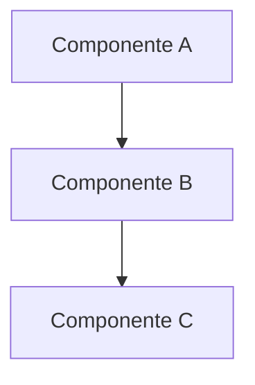

# Nome do Projeto

## 📝 Resumo
[Breve descrição do projeto e seus objetivos principais]

## 📋 Índice
- [Sobre](#sobre)
- [Objetivos](#objetivos)
- [Escopo](#escopo)
- [Tecnologias](#tecnologias)
- [Arquitetura](#arquitetura)
- [Cronograma](#cronograma)
- [Riscos e Mitigações](#riscos-e-mitigações)
- [Equipe](#equipe)
- [Referências](#referências)

## 📖 Sobre
[Descrição detalhada do projeto]

## 🎯 Objetivos
- Objetivo 1
- Objetivo 2
- Objetivo 3

## 🔍 Escopo
### Incluso
- Item 1
- Item 2

### Não Incluso
- Item 1
- Item 2

## 💻 Tecnologias
- Tecnologia 1
  - Versão
  - Propósito
- Tecnologia 2
  - Versão
  - Propósito

## 🏗️ Arquitetura

## 📅 Cronograma
| Fase | Início | Término | Status |
|------|---------|---------|--------|
| Fase 1 | DD/MM/YYYY | DD/MM/YYYY | 🟢 |
| Fase 2 | DD/MM/YYYY | DD/MM/YYYY | 🟡 |
| Fase 3 | DD/MM/YYYY | DD/MM/YYYY | ⚪ |

## ⚠️ Riscos e Mitigações
| Risco | Impacto | Probabilidade | Mitigação |
|-------|---------|---------------|------------|
| Risco 1 | Alto | Média | Estratégia de mitigação |
| Risco 2 | Médio | Baixa | Estratégia de mitigação |

## 👥 Equipe
| Nome | Papel | Contato |
|------|-------|---------|
| [Nome] | [Papel] | [Email] |

## 📚 Referências
- [Referência 1](link)
- [Referência 2](link)

---

**Documento gerado por AlttabCorp**

Data da última atualização: DD/MM/YYYY

 